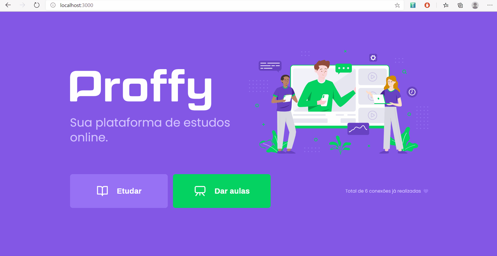

## Description

Proffy study platform is Rocketseat's project for the Next Level Week (NLW) program, created using ReactJS framework.

In this web interface, teachers can create classes just by describing a little bit of themselves, defining class price and available schedule.

Then, students can search for classes they wish to take by filtering for a subject and a schedule. Scrolling the teacher list, if the user find a match they can contact the teacher via whatsapp and arange the class.


## Setup

To launch the web interface, just run:

```
  yarn install
  yarn start
```


## Demo


